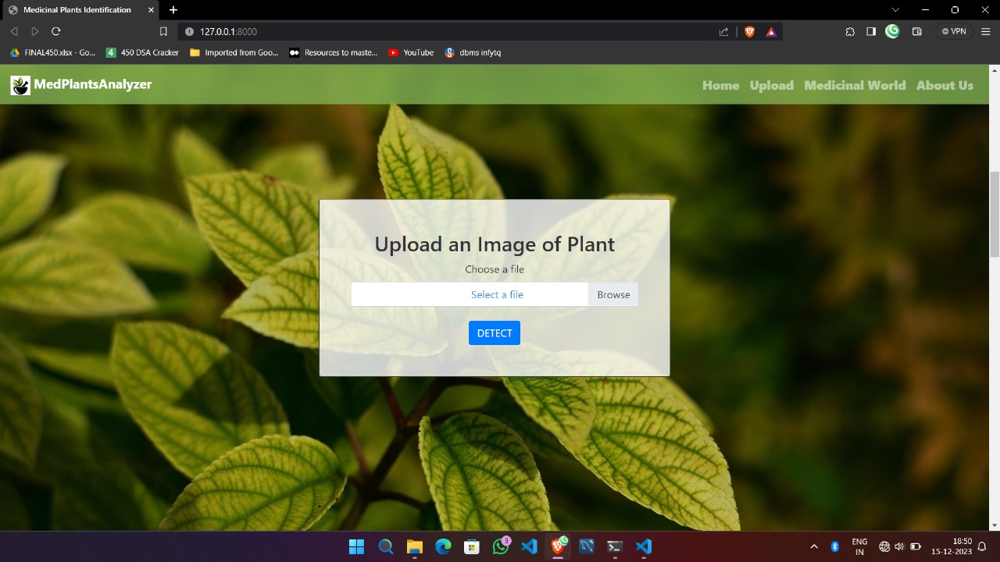
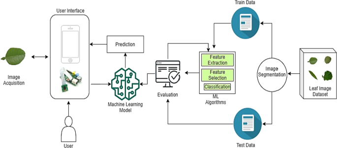

# MedPlantsAnalyzer  
  
  
  

Medicinal Plant Image Classifier is a state-of-the-art deep learning project designed to transform the identification and classification of medicinal plants. By utilizing the power of advanced convolutional neural networks (CNNs), this project aims to automate and significantly improve the accuracy of medicinal plant identification, supporting vital research in traditional medicine, biodiversity conservation, and pharmaceutical development.MedPlantsAnalyzer is a powerful deep learning system designed to revolutionize the field of medicinal plant identification. Leveraging the capabilities of convolutional neural networks (CNNs), this project offers:

## Automated and Accurate Identification: 
Achieve over 95% accuracy in classifying 81 distinct medicinal plant species.
## Transfer Learning Efficiency: 
Utilize pre-trained models like VGG16, ResNet, and MobileNet for faster development and superior performance.
## Data Augmentation Robustness: 
Employ advanced techniques to improve model resilience against variations in image data.
## User-Friendly Interface: 
Interact with the system through an intuitive web interface for convenient plant image upload and identification.  

# Key Technologies:  

Programming Language: Python 3.8  

Deep Learning Framework: TensorFlow 2.0, Keras 2.3.0  

Image Processing: OpenCV (cv2)  

Data Manipulation: NumPy, Pandas  

Visualization: Matplotlib, Seaborn  

Web Framework: Flask  

Version Control: Git, GitHub  

Cloud Platform: Google Colab (Optional for training and deployment)  

# Model Performance:

## Model	Top-1 Accuracy	Top-5 Accuracy	Parameters  

## VGG16	
93.7%	98.2%	138M  

## ResNet50	
95.2%	99.1%	25.6M  

## MobileNet	
91.8%	97.6%	4.2M  

# Dataset:  

The project leverages a comprehensive dataset of medicinal plant images featuring:  

81 unique plant species  

Over 10,000 high-resolution images  

Diverse plant parts (leaves, flowers, stems)  

Images captured under various environmental conditions  

# Future Work:

Expand the dataset to encompass over 200 medicinal plant species.  

Integrate spectral and hyperspectral imaging data for enhanced identification.  

Optimize the system for real-time mobile application deployment.  

Collaborate with botanists and pharmacologists for domain-specific improvements.  

We welcome contributions and feedback!
